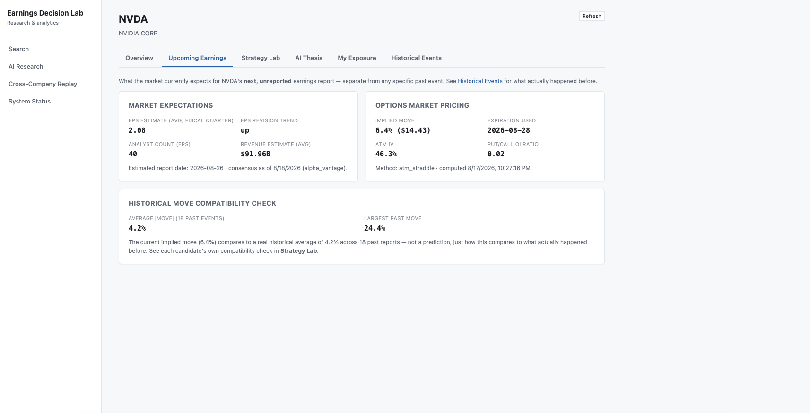
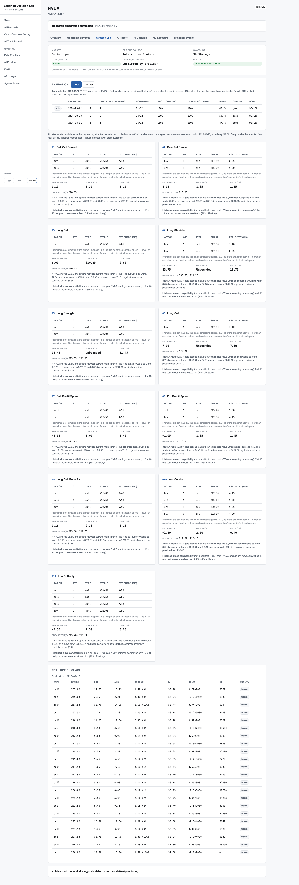
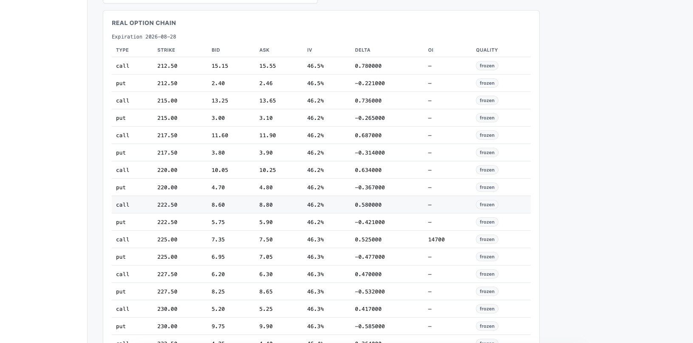
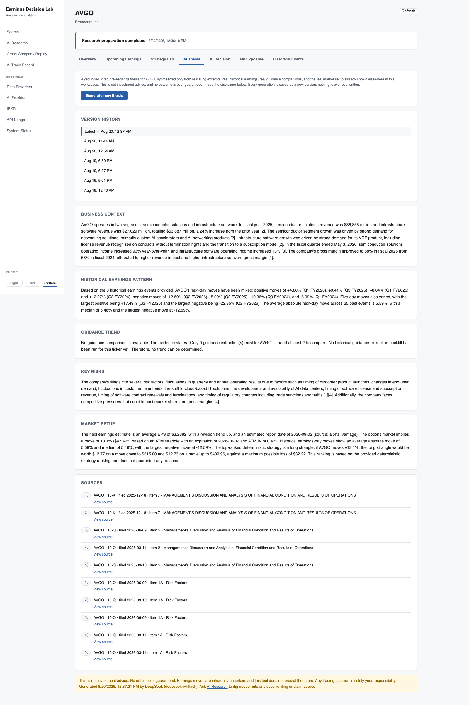
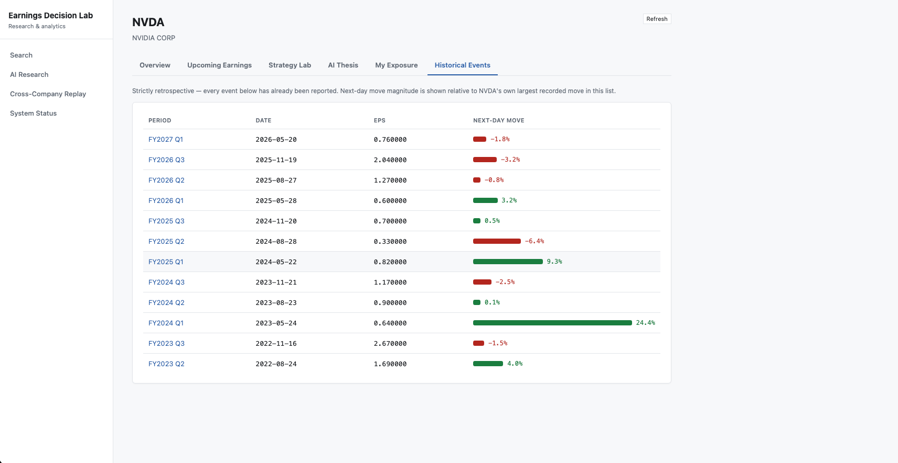

# Earnings Decision Lab

**An on-demand earnings research and AI-assisted options decision system.** Search a stock, and
the system prepares its earnings history, filings, expectations, price data, and option-chain
data; synthesizes a grounded AI Earnings Thesis; classifies a direction/volatility view; and
deterministically ranks real option strategies against that view — with every decision persisted
as a point-in-time record and, once real outcomes exist, honestly evaluated.

> **Not investment advice.** A personal research tool, not a trading system. See
> [Disclaimer](#disclaimer).

## Why this exists

Before an earnings release, I want to know: what happened last time, how did the stock react,
what is the market currently pricing in, and what has management actually said in its own
filings — not a summary someone else wrote, but the real text, cited. Then I want that evidence
turned into an actual, explainable view — not just data — and I want to remember what I decided
and how it turned out, without re-deriving it from scratch every time. This system does the
mechanical parts (fetching, storing, computing) deterministically in Python, uses an LLM only for
the parts that genuinely need language understanding, and never lets either one quietly forget or
overwrite what it produced.

## How it works

1. **Search a ticker.** Symbol resolution against a real reference dataset; no hard-coded list.
2. **Prepare or refresh research.** Earnings history, filings, price data, analyst estimates, and
   options data are ingested on demand, with real, persistent progress — a job that finishes with
   a warning still leaves a usable workspace, and existing data stays visible while a refresh runs.
3. **Review the upcoming earnings event** — consensus expectations, implied move, ATM IV, and the
   real options-market state (a chain can exist without enough priceable quotes to compute a move,
   and that's shown explicitly, not collapsed into "no data").
4. **Read the grounded AI Earnings Thesis** — a cited synthesis of filings, historical pattern, and
   guidance trend, persisted so it survives navigation, a browser refresh, or a backend restart.
5. **Generate an AI Decision** — a direction (strong bullish → strong bearish) and volatility view
   (long/neutral/short vol), classified by the LLM from that same real evidence, with a confidence
   score built entirely from real signals (evidence coverage, consensus agreement, historical
   consistency, data freshness, options completeness) — never the model's own self-rating.
6. **Compare ranked option strategies** built deterministically from the real chain against that
   view — legs, debit/credit, max profit, max loss, breakeven, and a six-component Model Strategy
   Score, with a recommended candidate plus alternatives.
7. **See why each strategy was suggested** — a "Why this strategy" / "Main risks" breakdown built
   entirely from real numbers already shown elsewhere, never invented by the LLM.
8. **Mark a Final Decision** once you're satisfied — later research creates new, separate versions;
   nothing is silently rewritten, and the Final Decision is the record used for later evaluation.
9. **After earnings, settle the outcome** where real data supports it — did the stock move in the
   predicted direction, did it cross the recommended structure's breakeven — without ever
   fabricating an options P&L the system doesn't actually have the data to compute.
10. **Track decision reliability over time** — directional accuracy, breakeven success, and (only
    when real point-in-time option pricing exists) strategy win rate, each with its own sample size.

## Current capabilities

**On-demand research**
- Search any supported US-listed ticker; symbol resolution against a real reference dataset
- On-demand ingestion — a ticker's earnings history, filings, price data, and options data are
  fetched and stored only once that ticker is actually requested
- Freshness-aware refresh — re-running research only re-fetches what's stale, not everything
- Real, persistent preparation status per run (`completed`, `completed_with_warnings`, `failed`),
  with a per-step result (done/failed/skipped, and whether the failure is worth retrying) that
  stays visible after the job finishes instead of disappearing the moment it does
- **Retry Missing Data** — re-attempts only the steps that actually failed or are stale, not a
  full re-fetch, and is hidden when the underlying failure (e.g. a provider's daily quota) won't
  be fixed by retrying right now
- Existing, previously-fetched data stays on screen during a refresh — a failed refresh shows
  "displaying last successful data," it never blanks the workspace

**Data Provider Control Center** (Settings → Data Providers / AI Provider / IBKR / System Status)
- Per-domain provider configuration — price history, earnings estimates, filings, options, and the
  LLM each show their real configured provider, with primary/fallback selection where more than
  one real adapter exists (price history and options)
- Provider health and a real **Test Connection** check per provider, with results recorded and
  shown with a timestamp
- Masked credential status only — a configured API key is shown as present/masked, never returned
  to the frontend in full
- Requested-provider / actual-provider / fallback-reason provenance is retained, so a page that
  fell back to a secondary provider says so rather than presenting it as the primary
- A strategy risk preference (see AI Options Decision Engine below), configurable from
  Settings → AI Provider

**Earnings**
- Real historical earnings events — EPS, report date, next-day and five-day price reaction —
  sourced from SEC EDGAR and Tiingo/Alpha Vantage
- The next, unreported earnings event tracked separately from historical events, so expectation
  and outcome are never mixed
- Analyst consensus (EPS/revenue estimates, analyst count, revision trend) for the next report
- Historical move statistics (average, median, largest move) computed from a company's own
  reported history

**Options & Strategy Lab**
- Real option-chain ingestion through the user's own Interactive Brokers account, with an
  Alpha Vantage adapter where the endpoint and plan entitlement allow it
- A canonical options-market state computed once and shared by every page that shows it: whether a
  chain exists at all, how many contracts are priceable (real bid/ask), whether IV/Greeks are
  available, and whether an implied move can actually be computed from them — a chain existing and
  a chain having enough priceable quotes are shown as genuinely different states, never collapsed
  into one generic "no data"
- Implied move and ATM IV computed from the real chain via an ATM-straddle method, only when the
  chain actually supports it
- Deterministic strategy-candidate generation across common categories (long call/put, spreads,
  straddle, strangle, iron condor) from real strikes and premiums — legs, net debit/credit, max
  profit, max loss, and breakeven are plain, unit-tested Python, never an LLM estimate
- Every candidate shows a **Model Strategy Score** and its component breakdown — explicitly
  labeled as a deterministic fit score, **not a probability of profit**
- A historical move compatibility check per candidate against the company's own real past
  earnings-day moves — see [Limitations](#limitations) for why this is not a backtest
- Advanced: a manual payoff calculator for arbitrary strikes/premiums, as a fallback outside the
  generated candidates

**AI Options Decision Engine**
- Classifies a direction (strong bullish → strong bearish) and volatility view (long/neutral/short
  vol) from the same real evidence the Earnings Thesis uses, then deterministically ranks real
  strategy candidates against that view
- A confidence score (0–100) built entirely from real, already-known signals — never the LLM's own
  self-reported certainty
- Every ranked candidate carries a "Why this strategy" / "Main risks" explanation built from real,
  already-computed numbers (breakeven distance, implied move, historical compatibility, capped
  risk) — the LLM explains, it never computes
- A strategy risk preference (Defined Risk Only by default, or Allow Single-Leg Long Options) caps
  which categories can be surfaced; uncovered/naked short options are not generated by this
  version of the product — see [Limitations](#limitations)
- An owner can override the AI's direction/volatility view manually; everything downstream
  (ranking, scoring, reasoning) stays fully deterministic either way

**Persistent AI Research**
- Every AI Research answer is persisted to PostgreSQL, not held only in frontend state — it
  survives navigating away, a browser refresh, and a backend or full Docker restart
- Recent research history, filterable by ticker, with citations and tool-trace provenance stored
  alongside the answer
- Selecting a past answer restores exactly what was generated, without re-running the LLM;
  answers can be individually deleted

**Persistent AI Earnings Thesis**
- Each generation is saved as a new, append-only version — a new thesis never overwrites an
  older one
- Every version records which analyst-estimate and options-volatility snapshot it was actually
  grounded in, so a stored thesis can be checked against *current* data and flagged as stale
  without ever silently pretending it used data that didn't exist yet at generation time
- Past versions reopen exactly as generated, never regenerated on selection

**Decision Journal**
- Every AI Decision generation is stored as a new, point-in-time version — later research never
  rewrites an earlier decision
- **Mark as Final Decision** designates the one record used for later, real evaluation; generating
  further versions afterward does not disturb it
- Each record keeps the real snapshot ids (analyst estimate, options volatility) and the exact
  strategy legs it was built from, for later, honest settlement

**Track Record & reliability**
- Once real post-earnings price data exists, a decision can be settled: did the stock move in the
  predicted direction (**Directional Accuracy**), did it cross the recommended structure's
  breakeven (**Breakeven Success**) — kept as two explicitly distinct metrics
- **Strategy Win Rate** is shown only when real, point-in-time option entry/exit prices actually
  exist for that decision — this project does not fabricate an options P&L it can't compute
- Every reported rate carries its real sample size (e.g. "10 / 14 decisions"), never a bare
  percentage; confidence-calibration buckets show whether higher stated confidence has actually
  correlated with higher realized accuracy so far
- The live track record only ever contains decisions the system actually recorded before the
  event they're about — see [No-lookahead principle](#no-lookahead-principle)

**Portfolio**
- Real, read-only positions from the user's own Interactive Brokers account, matched to the
  researched ticker
- Never a market-quote source; never places, modifies, or cancels an order

**System**
- Python 3.12 / FastAPI / SQLAlchemy 2.0 / Alembic / PostgreSQL + pgvector
- React 18 + TypeScript / Vite frontend
- Docker Compose for the full stack; GitHub Actions CI (frontend, backend, and Docker
  build-and-boot jobs) on every push
- Provider abstraction for market data, filings, options, and the LLM, so a provider can be
  swapped — by the owner, at runtime, from Settings — without touching calling code

## Data-state UX

Every data point that comes from an external provider is shown with an explicit state, never
silently presented as more current than it is: `live`, `delayed`, `frozen`, `stale`,
`previous_session`, `market_closed`, `gateway_disconnected`, `provider_unavailable`,
`rate_limited`, `premium_required`, `not_collected`, `unsupported`. A frozen or stale quote is
still shown — it's real, already-ingested data — but labeled as what it is rather than blended in
with a live one.

## Supported tickers and data

The system was originally exercised against a handful of tickers (NVDA, AMD, MU, SNDK) while it
was being built, but that was never a hard-coded limit — search prepares research for any
supported US-listed ticker on demand, and detailed data (earnings history, filings, price bars,
options snapshots) is ingested and persisted only once a ticker is actually requested, rather than
preloading thousands of companies nobody has asked about. Provider coverage (SEC EDGAR, Tiingo,
Alpha Vantage, IBKR) can vary by ticker: a newly requested company may come back with partial
data, or a preparation run may complete with warnings, if a provider has limited or no data for it.

As of the most recent local run (the live `GET /api/v1/system-status` endpoint): 8 companies
researched, 308 earnings events, 43,270 daily price bars, 223 SEC filings, 4,170 searchable
filing chunks. These are live counts for one local deployment, not a fixed catalog — they change
every time a ticker is researched, so treat them as an example snapshot rather than a permanent
number.

## Screenshots

| | |
|---|---|
|  **Home** — search-first, recently researched companies |  **Upcoming Earnings** — consensus, implied move, ATM IV, historical comparison |
|  **Strategy Lab** — ranked candidates from a real option chain, with breakeven and historical compatibility |  **Option Chain** — real strikes, bid/ask, delta, IV, OI, market-data quality |
|  **AI Earnings Thesis** — grounded, cited synthesis |  **Historical Events** — real past earnings moves |

Additional screens: [Company Overview](docs/screenshots/company_overview.png) ·
[AI Research](docs/screenshots/ai_research.png) (grounded Q&A with tool trace) ·
[My Exposure](docs/screenshots/my_exposure.png) (real IBKR positions) ·
[System Status](docs/screenshots/system_status.png) (live data coverage and freshness) ·
[Cross-Company Replay](docs/screenshots/cross_company_replay.png).

These screenshots are from a recent local build. The AI Options Decision Engine and Track Record
pages (Phase 14.9) aren't pictured yet — a full screenshot refresh is planned after the next UI
polish pass.

## Architecture

```
backend/    FastAPI service: providers, research orchestration, analytics, RAG, agents, API
frontend/   React + TypeScript research workspace
evaluation/ Hand-curated Q&A dataset and scripts that measure retrieval/RAG/agent/extraction quality
docs/       Architecture, methodology, and engineering-decision documentation (see below)
```

```
User
  -> Research Preparation Orchestrator (symbol resolution, freshness/cache, provider routing)
  -> Providers (SEC EDGAR, Tiingo, Alpha Vantage, IBKR)
  -> PostgreSQL + pgvector
  -> Deterministic analytics (earnings, options, strategy candidates/scoring, historical moves)
  -> AI Earnings Thesis / AI Options Decision Engine (RAG + tool orchestration)
  -> Strategy ranking
  -> Decision Journal (point-in-time versions, Final Decision)
  -> Post-earnings settlement / Track Record
  -> React research workspace
```

The no-lookahead-bias principle governs the whole data model: every pre-earnings snapshot stores
only what existed at that timestamp, every externally-sourced record carries its provider and
retrieval time, and an AI Decision or Earnings Thesis version is never edited after the fact — new
evidence produces a new version, not a silent rewrite. Full design rationale — including
deliberate scope boundaries and what was evaluated and rejected — in
[docs/engineering_decisions.md](docs/engineering_decisions.md).

## Interactive Brokers integration

Real option-chain data and portfolio positions come from the user's own Interactive Brokers
account via the official, locally-run **Client Portal Gateway** — read-only, no order placement,
modification, or cancellation anywhere in the integration. The Gateway is deliberately
**local-first**: it runs and is authenticated on the user's own machine, and this project never
sees an IBKR username, password, or 2FA code; the Gateway session can also expire and require
local re-authentication. Cloud/Azure synchronization for IBKR data has not been implemented — if
this system is ever deployed off a local machine, the Gateway either keeps running locally and
forwards already-collected snapshots, or a different, officially supported IBKR cloud
authentication model would need to be adopted first. That decision is explicitly deferred, not
solved by what exists today. Full architecture and real, live-captured request/response examples
in [docs/ibkr_integration.md](docs/ibkr_integration.md).

## Deterministic analytics vs. AI

A core design principle of this system: **all financial arithmetic is deterministic Python, never
an LLM guess.** Breakeven, max profit/loss, net premium, implied move, ATM IV, historical move
statistics, strategy scores, and settlement metrics are all computed by plain code with unit
tests. The AI Options Decision Engine follows the same split explicitly:

| | LLM | Deterministic Python |
|---|---|---|
| Does | Interprets filing text, synthesizes evidence, classifies direction/volatility, writes the explanation | Payoff math, breakeven, max profit/loss, score components, historical move comparisons, settlement metrics |
| Never does | Compute a number, invent a strike or premium | Judge qualitative evidence or write prose |

Every AI-generated answer is grounded in data computed or retrieved by the deterministic layer,
cited back to its source, and never the source of a number that appears elsewhere in the app.

## No-lookahead principle

Point-in-time correctness is enforced structurally, not just by convention: an AI Decision or
Earnings Thesis is only ever created going forward, from a real generation call — nothing is
backfilled after the fact using information that wasn't available yet. Concretely, this means:

- The live Track Record only ever contains decisions the system actually recorded *before* the
  earnings event they're being evaluated against.
- There is no code path that manufactures a retrospective "the AI would have predicted this"
  entry using outcome data the system already knows.
- A separate, explicitly labeled **Historical Replay** experiment (reconstructing only what was
  knowable before a past event) is a distinct, clearly-labeled dataset if it's ever built — it
  must never be merged into or presented as the live decision track record.

## Measured evaluation

This system's AI components are evaluated against a hand-curated, hand-verified dataset, not
graded on impression
([docs/evaluation.md](docs/evaluation.md) has full methodology, per-item results, and an honest
discussion of *why* retrieval scores what it does):

| Category | Metric | Result |
|---|---|---|
| Retrieval (18 hand-verified items) | Recall@5 | 35% |
| RAG answer (15 items, incl. 1 negative control) | Fact coverage | 70% |
| Agent orchestration (10 items) | Intent + tool-selection accuracy | 100% |
| Structured extraction (8 items) | Capex-guidance accuracy | 100% |

## Testing and quality

Verified against the current repository: 688/688 backend tests passing on a clean, disposable
database, `ruff` clean, `mypy` clean, frontend `tsc` typecheck clean, frontend `eslint` clean,
frontend production build clean, and a full Docker Compose stack (`db` → `migrate` → `backend` →
`frontend`) building and booting successfully. GitHub Actions runs the frontend, backend, and
Docker jobs on every push to `main`, all green as of the latest commit.

## Documentation

| Doc | Covers |
|---|---|
| [docs/architecture.md](docs/architecture.md) | System design as of Phase 11 — schema, providers, and module status at that point; superseded on research orchestration, Strategy Lab, and AI Thesis/Decision Engine by this README and the phases below |
| [docs/data_model.md](docs/data_model.md) | Table grain, keys, indexing, point-in-time semantics |
| [docs/data_sources.md](docs/data_sources.md) | Providers evaluated, chosen, and why (incl. two rejected for blocking automated access) |
| [docs/options_methodology.md](docs/options_methodology.md) / [docs/earnings_methodology.md](docs/earnings_methodology.md) | Payoff formulas, Greeks assumptions, implied-move methodology |
| [docs/llm_providers.md](docs/llm_providers.md) | Provider-agnostic LLM layer |
| [docs/ai_architecture.md](docs/ai_architecture.md) | RAG pipeline + agent orchestration design |
| [docs/ibkr_integration.md](docs/ibkr_integration.md) | Interactive Brokers integration architecture, auth flow, real request/response examples |
| [docs/evaluation.md](docs/evaluation.md) | Evaluation methodology, real results, honest analysis |
| [docs/deployment.md](docs/deployment.md) | Docker architecture, real cost research for hosting |
| [docs/engineering_decisions.md](docs/engineering_decisions.md) | Every major technical decision and why, phase by phase, including real bugs found and fixed along the way |
| [docs/limitations.md](docs/limitations.md) | Known gaps for Phases 1–10 in detail; see this README's own [Limitations](#limitations) section for what's specific to later phases |
| [SYSTEM_AUDIT.md](SYSTEM_AUDIT.md) | An independent verification pass against the real system, dated to Phase 11 |

## Local setup

```bash
cp .env.example .env   # fill in real values — see docs/data_sources.md and docs/llm_providers.md
docker compose up --build
```

Runs the full stack: PostgreSQL + pgvector, a one-shot Alembic migration, the FastAPI backend
(`http://localhost:8000`), and the frontend (`http://localhost:5173`). Backend and frontend can
also be run independently outside Docker — see `backend/README.md` and `frontend/README.md`.

Everything works without a running IBKR Client Portal Gateway except real option-chain data,
IBKR-sourced implied move/ATM IV, and Portfolio/My Exposure — those show an explicit
not-available state instead of a number. See
[docs/ibkr_integration.md](docs/ibkr_integration.md) for how to run and authenticate the Gateway
locally.

## Limitations

- The IBKR Client Portal Gateway requires local authentication on the user's own machine and its
  session can expire and need re-authentication; there is no cloud-hosted IBKR connection today,
  and Azure/cloud synchronization for IBKR data has not been built (see
  [Interactive Brokers integration](#interactive-brokers-integration)).
- Provider rate limits and plan entitlements (e.g. a free-tier daily quota) can degrade an
  individual preparation step — a malformed or degraded provider response is detected rather than
  silently parsed as real data, and an optional step's failure does not invalidate the rest of an
  already-prepared research workspace.
- An options chain can exist without enough priceable quotes (real bid/ask) to compute an implied
  move or generate strategy candidates from — this is shown as its own explicit state, never
  collapsed into a generic "no data."
- Complete historical point-in-time options-chain data does not exist for all past earnings
  events, so historical move compatibility compares against real past price moves, not a real
  options backtest.
- The Model Strategy Score is a deterministic, explainable heuristic, not a probability of profit
  or a recommendation; AI Decision confidence is likewise built from real signals, not a
  probability that the direction will turn out correct.
- The AI decision track record currently has a limited sample size — confidence-calibration and
  win-rate figures become more meaningful as more real, settled decisions accumulate.
- Strategy Win Rate is only ever shown for a decision with real, point-in-time option entry/exit
  pricing on record; this project does not yet capture that data for most decisions, so the metric
  is honestly absent rather than estimated.
- No retrospective AI predictions are ever inserted into the live track record — see
  [No-lookahead principle](#no-lookahead-principle).
- Decision/thesis/research history management is currently owner/private functionality without
  production authentication in front of it — acceptable for a local, single-owner deployment, not
  yet suitable for a public multi-user one.
- Cloud deployment (Azure or otherwise) has not been implemented.
- AI-generated research (the Earnings Thesis, AI Decision, AI Research answers) is grounded in
  retrieved evidence but is only as complete as that evidence — a newly researched company with
  sparse filing history produces a correspondingly limited answer.

Full, phase-by-phase list for Phases 1–10 in [docs/limitations.md](docs/limitations.md).

## Disclaimer

This is a personal research tool. It is not investment advice, has no live users, and no claim is
made about trading performance — see [docs/limitations.md](docs/limitations.md) and the
[Limitations](#limitations) section above for a full, honest account of what is and isn't real.

## License

MIT — see [LICENSE](LICENSE).
