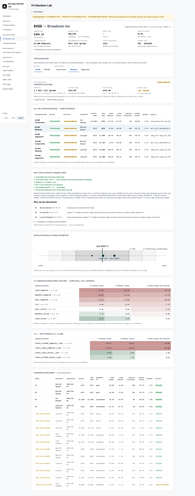
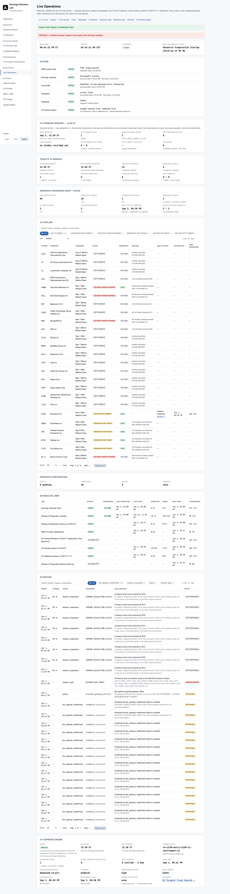
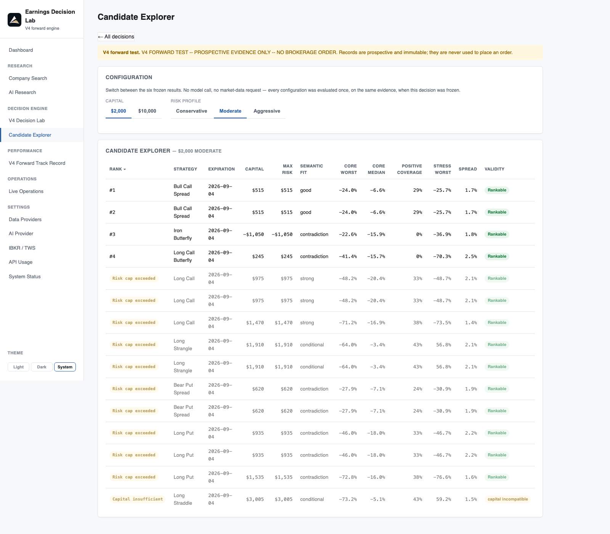

<p align="center">
  
</p>

<h1 align="center">Earnings Decision Lab</h1>

<p align="center">
  AI-assisted earnings options research, a deterministic decision engine, and prospective forward testing —
  one V4 engine that decides at 15:30 ET, observes an executable entry for six standardized configurations,
  and settles at 15:30 ET on the first post-earnings trading day. No orders are ever placed.
</p>

<p align="center">
  <a href="CHANGELOG.md">v4.0.0</a> ·
  <a href="docs/v4_architecture.md">Architecture</a> ·
  <a href="docs/v4_methodology.md">Methodology</a> ·
  <a href="docs/v4_forward_testing.md">Forward testing</a> ·
  <a href="docs/releases/v4.0.0.md">Release notes</a>
</p>

> A personal research instrument. Nothing here is investment advice, a recommendation, or a claim
> of profitability.

## Overview

Earnings Decision Lab combines three things around one earnings event:

- **AI-assisted research** — SEC filings, price history, estimates and options snapshots are
  prepared automatically ahead of each event; a DeepSeek model writes the research thesis and,
  at decision time, one structured **DecisionView** (direction, volatility view, move intent,
  confidence).
- **A deterministic decision engine** — expected move, strategy semantics, strike geometry,
  candidate generation, T+1 scenario valuation, ranking and capital sizing are versioned Python.
  The AI never ranks, sizes, prices or executes anything.
- **Prospective forward testing** — every decision is frozen at its legal 15:30 ET window with
  the quotes it was made from, an executable entry is observed for six configurations, and the
  position is settled at 15:30 ET on the first post-earnings trading day. Evidence is immutable.

## Why it exists

An earnings options decision has to combine research, market expectations, the actual option
chain, risk and execution reality — and then be validated forward, not explained backward. Most
tooling does one of these. This lab does all of them in one auditable pipeline, and it keeps
the honest answer ("no action", "insufficient sample", "window missed") as first-class evidence.

## Architecture

```
Earnings Calendar (EarningsAPI → Finnhub fallback)
  ↓
Research Preparation (nightly 21:00 ET · 13:00 ET catch-up · startup catch-up)
  ↓
Company Evidence / RAG (EDGAR filings, prices, estimates, options snapshots, AI thesis)
  ↓
DeepSeek DecisionView (deepseek-v4-pro, thinking enabled; provenance frozen)
  ↓
Expected Move (implied + historical context)
  ↓
Semantic Compatibility (view ↔ structure)
  ↓
Strike Geometry (candidates placed against ±expected move)
  ↓
Candidate Generation (one frozen evidence universe per event)
  ↓
T+1 Scenario Valuation (core + stress grids, executable bid/ask)
  ↓
Ranking v1 (v4-4b-t1-executable-ranking-v1)
  ↓
Six Configurations ($2K / $10K × Conservative / Moderate / Aggressive)
  ↓
15:30 ET Entry Observation (legal pre-earnings trading day)
  ↓
Post-Earnings T+1 15:30 ET Settlement (due exits before new decisions)
  ↓
Forward Track Record (six cohorts, counts and standardized returns)
```

| Layer | Where |
|---|---|
| FastAPI backend · SQLAlchemy 2.0 · Alembic · APScheduler | `backend/src` |
| Research worker (own process, own TWS client id) | `backend/src/workers` |
| V4 engine (methodology, semantics, geometry, T+1 grids, ranking, configurations) | `backend/src/analytics/decision/v4_*.py` |
| V4 forward evidence (append-only, database trigger) | `backend/src/models/v4_shadow.py` |
| Forward window, cohorts, settlement, scheduler | `backend/src/services/v4_shadow_*.py`, `services/scheduler.py` |
| Operations read model | `backend/src/services/operations.py` |
| React + Vite + TypeScript frontend | `frontend/src` |
| PostgreSQL + pgvector · Docker Compose | `docker-compose.yml` |

The internal `v4_shadow_*` names are historical (V4 began as a shadow cohort). In the product
these are the **V4 Forward Test** surfaces.

<p align="center"></p>

## Six configurations

| Key | Capital | Risk cap | Max risk | Liquidity floor | Families |
|---|---|---|---|---|---|
| `v4_2k_conservative` | $2,000 | 15% | $300 | 0.80 two-sided | no single-leg longs |
| `v4_2k_moderate` | $2,000 | 30% | $600 | 0.40 | all generated |
| `v4_2k_aggressive` | $2,000 | 50% | $1,000 | none | all generated |
| `v4_10k_conservative` | $10,000 | 15% | $1,500 | 0.80 | no single-leg longs |
| `v4_10k_moderate` | $10,000 | 30% | $3,000 | 0.40 | all generated |
| `v4_10k_aggressive` | $10,000 | 50% | $5,000 | none | all generated |

All six read the **same** frozen market evidence and differ only in risk profile, capital fit,
quantity, final position and therefore realized result. Each may independently produce
`RANKED` or `NO_ACTION`; nothing is relaxed to make all six trade.

<p align="center"></p>

## AI vs deterministic components

| DeepSeek (judgment) | Python (arithmetic, frozen and versioned) |
|---|---|
| market direction | financial math (payoff, Black–Scholes, implied move) |
| expected-move / volatility judgment | strategy geometry and semantics |
| reasoning and confidence | T+1 valuation, ranking, capital sizing |
| research thesis | entry / exit math, settlement, track record |

The DecisionView model is one explicitly configured model (`V4_DECISION_VIEW_MODEL`). There is no
fallback: a missing or invalid configuration produces a recorded failure, never a substitute view.

## Point-in-time evidence

- **No look-ahead.** A decision sees only what existed at its 15:30 ET window; research is
  prepared before, never after.
- **Immutable.** Every V4 evidence table rejects updates at the database level. A row is
  superseded by a new row, never edited.
- **No backfill.** V4 evidence begins prospectively on 2026-09-02. Empty states are real.

## Market data

Interactive Brokers **TWS API** over the socket connection: one long-lived socket per process,
bounded timeouts, typed errors, a per-run request budget. The current entitlement delivers
**delayed** market data, and every quote, row and page says so. See
[docs/ibkr_architecture.md](docs/ibkr_architecture.md).

## Timing

| | When |
|---|---|
| Decision + entry observation | **15:30 ET** on the last trading day before the announcement |
| Settlement | **15:30 ET** on the first post-earnings trading day |
| AMC announcement | D0 15:30 → D+1 15:30 |
| BMO announcement | D−1 15:30 → D0 15:30 |

At the shared 15:30 window **due settlements run first, then new decision observations**: one
`v4_forward_window` job settles every position whose legal window is open (lock held only around
quote acquisition, window re-checked at acquisition), then begins new decisions, each holding the
market-data lock only for its own chain sweep — never during the DecisionView call. Settlement is
bounded to ±5 minutes (`SETTLEMENT_WINDOW_MISSED` otherwise); new evaluations stop at the 15:50
ET deadline (`DEADLINE_SKIPPED`). Policy `v4-1530-entry-1530-t1-settlement-v2`.

<p align="center"></p>

## Forward testing

V4 begins prospectively; there is no historical V4 performance and no earlier engine's results
are included. Below **30 settled observations** a cohort shows `INSUFFICIENT SAMPLE` and no win
rate or return. No profitability is claimed.

<p align="center"></p>

## Frontend

Dashboard · Company Search · AI Research · Company workspace (Overview, Earnings Setup,
Research, Market View, V4 Decision, Candidates, Forward Outcome) · V4 Decision Lab · Candidate
Explorer · V4 Forward Track Record · Live Operations · Settings (Data Providers, AI Provider,
IBKR / TWS, API Usage) · System Status. More screenshots in [docs/screenshots](docs/screenshots).

## Safety

No brokerage execution, no order-placement API, no position modification: the IBKR
integration is data-only and read-only by application design. Delayed data stays labelled
delayed. Credentials live only in `.env` (never committed); provider keys are shown masked.

## Technology

Python 3.12 · FastAPI · PostgreSQL + pgvector · SQLAlchemy 2.0 · Alembic · APScheduler ·
React · TypeScript · Vite · Playwright · Interactive Brokers TWS API · DeepSeek · SEC EDGAR + RAG.

## Setup

```bash
cp .env.example .env            # your own keys; never commit .env
docker compose up -d db migrate backend research-worker frontend
open http://localhost:5173
```

Defaults: frontend `:5173`, backend `:8000`, PostgreSQL `:5433`. Market data needs a running
IB Gateway / TWS with the API enabled (`IBKR_PROVIDER=tws`); without it the product runs on
persisted snapshots and reports the transport as disconnected.

## Testing

```bash
cd backend && .venv/bin/python -m pytest -q      # disposable test DB (:5434), live TWS guard
cd frontend && npx tsc -b && npx eslint . --max-warnings 0 && npm run build && npx playwright test
```

Backend tests rebind every session factory to the test database and refuse live TWS sockets.
Playwright runs on route-mocked fixtures (deterministic navigation and Live Operations suites
included); live QA is opt-in with `RUN_LIVE_QA=1`.

## Status

**v4.0.0** — the software is released; the forward evidence sample is still immature and no
performance is statistically established. See [CHANGELOG.md](CHANGELOG.md) and
[docs/releases/v4.0.0.md](docs/releases/v4.0.0.md).

## Documentation

| Doc | Covers |
|---|---|
| [docs/v4_architecture.md](docs/v4_architecture.md) | One event → one evidence freeze → six results; modules and tables |
| [docs/v4_methodology.md](docs/v4_methodology.md) | Objective, strategy semantics, capital terminology, why V4 exists |
| [docs/v4_4b_candidate_ranking_methodology.md](docs/v4_4b_candidate_ranking_methodology.md) | The frozen T+1 executable ranking |
| [docs/v4_forward_testing.md](docs/v4_forward_testing.md) | Evidence rules, timing, windows, settlement priority, model provenance |
| [docs/ibkr_architecture.md](docs/ibkr_architecture.md) | TWS integration and runtime |
| [docs/ai_architecture.md](docs/ai_architecture.md) · [docs/llm_providers.md](docs/llm_providers.md) | RAG pipeline, agent, provider layer |
| [docs/options_methodology.md](docs/options_methodology.md) · [docs/earnings_methodology.md](docs/earnings_methodology.md) | Shared payoff, pricing, implied-move and earnings analytics |
| [docs/data_model.md](docs/data_model.md) · [docs/data_sources.md](docs/data_sources.md) | Tables and providers |
| [docs/evaluation.md](docs/evaluation.md) · [docs/deployment.md](docs/deployment.md) · [docs/limitations.md](docs/limitations.md) | Evaluation, Docker, known gaps |
| [docs/brand/BRAND.md](docs/brand/BRAND.md) | Logo usage |

## Disclaimer

This is a personal research tool. Nothing here is investment advice, a recommendation, or an
offer to trade. Options involve substantial risk.

## License

See [LICENSE](LICENSE).
