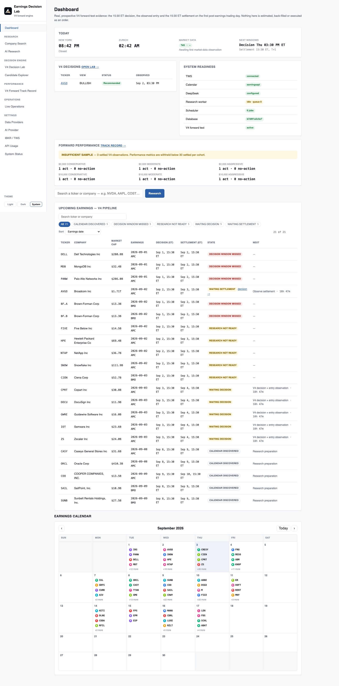
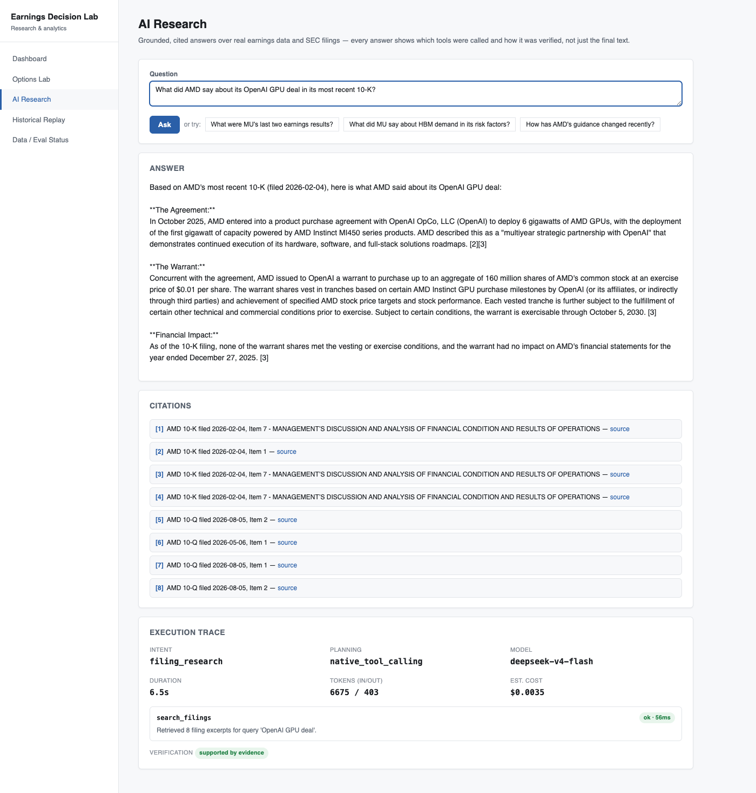
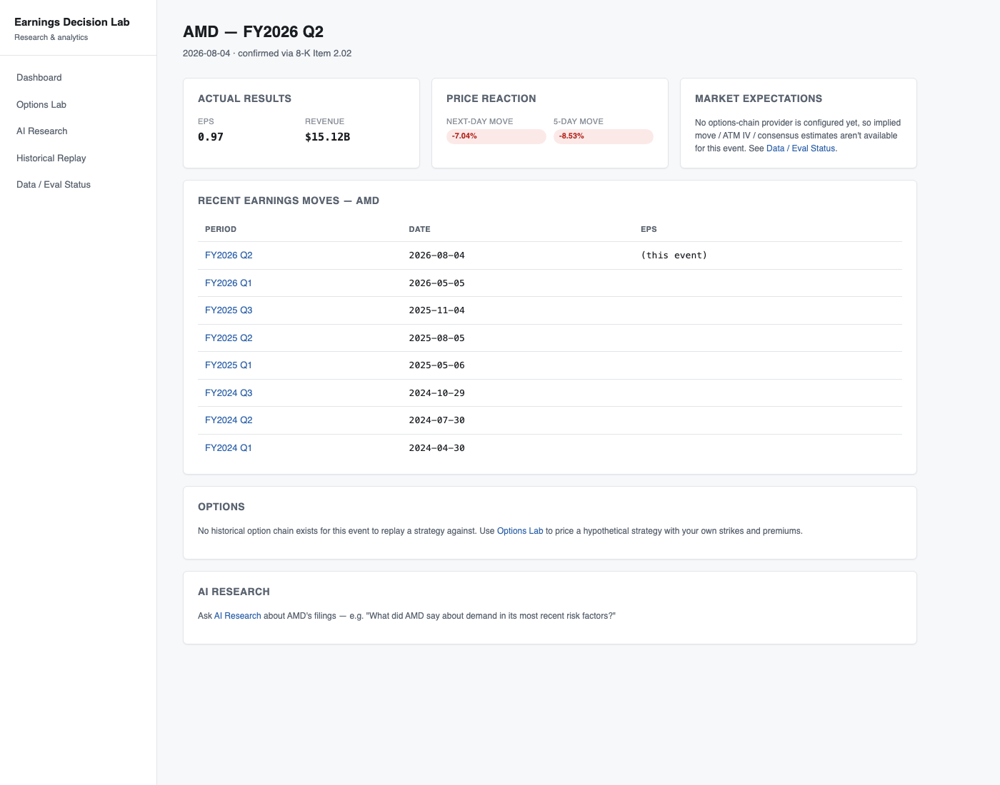
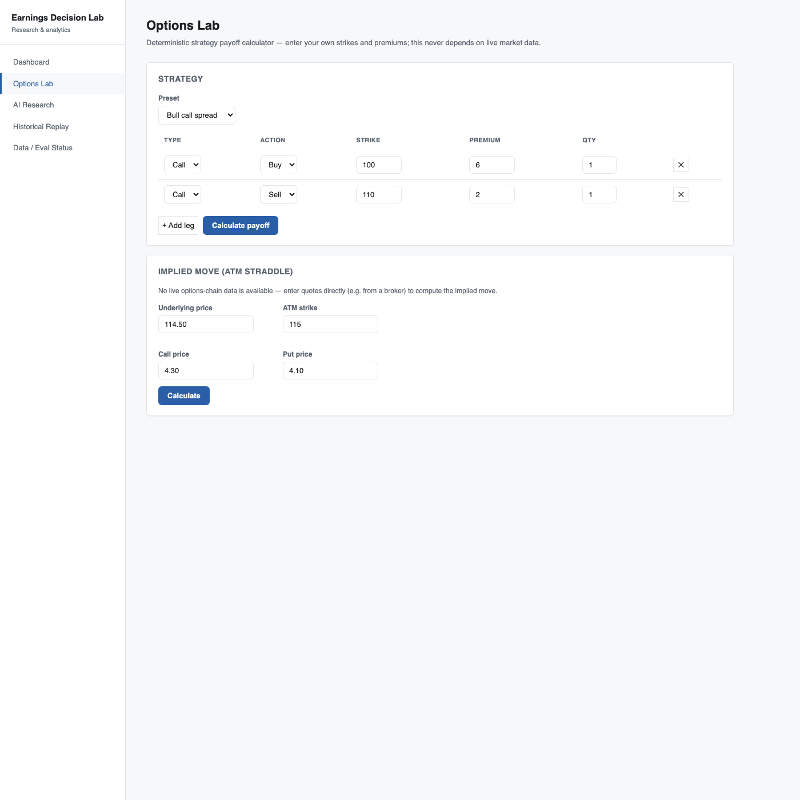
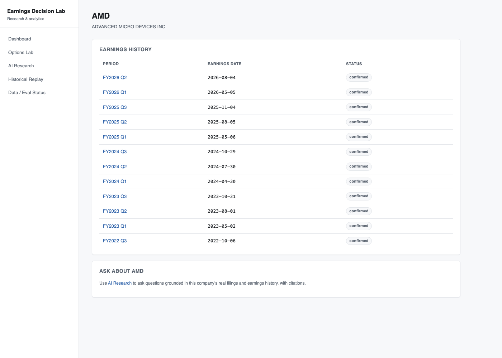
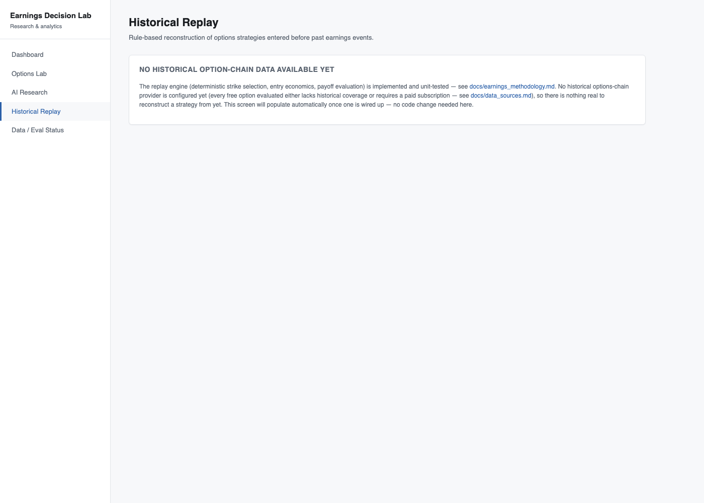

# Earnings Decision Lab

**A personal research system for earnings-event analysis, market reactions, SEC filings, and options analytics — with an AI research assistant layered on top of deterministic financial calculations.**

> **Not investment advice.** A personal research tool, not a trading system. See
> [Disclaimer](#disclaimer).

## Why this exists

Before an earnings release, I want to know: what happened last time, how did the stock react,
what is the market currently pricing in, and what has management actually said in its own
filings — not a summary someone else wrote, but the real text, cited. Most of that requires
pulling together data from several places (SEC filings, price history, options pricing) and
reading dense documents quickly. This system does the mechanical parts (fetching, storing,
computing) deterministically in Python, and uses an LLM only for the parts that genuinely need
language understanding — reading filing text, answering questions, comparing guidance language
across quarters — never for arithmetic.

## Current capabilities

| | |
|---|---|
| **What it does** | For NVDA, AMD, MU, SNDK: real historical earnings results and price reactions, real SEC filing search with citations, a deterministic options-strategy calculator, and an AI research assistant that plans and executes real tool calls against real data (not a single LLM call pretending to be an agent) |
| **Stack** | Python 3.12 / FastAPI / SQLAlchemy 2.0 / Alembic / PostgreSQL + pgvector · React 18 + TypeScript / Vite · Docker Compose · GitHub Actions CI |
| **AI architecture** | Provider-agnostic LLM layer (DeepSeek / OpenAI / Anthropic / any OpenAI-compatible endpoint) · hybrid (vector + keyword, RRF-fused) retrieval over real SEC filings · explicit multi-stage agent (intent → plan → tool execution → verification) |
| **Real data** | 150 real earnings events, 25k+ real daily price bars, 93 real SEC filings, 2,231 real filing chunks — sourced from SEC EDGAR, Tiingo, Alpha Vantage |
| **Measured, not claimed** | 243 automated tests (unit/API/provider/RAG/agent), a 51-item hand-verified evaluation dataset with real measured results (below), CI green on every push including a full Docker build-and-boot check |
| **Deployment status** | Docker-verified and ready to run (`docker compose up --build` runs the full real stack locally) — **not** deployed to a public host; see [docs/deployment.md](docs/deployment.md) for the cost research and why |
| **Honesty as a design principle** | Every screen that has no real data shows an explicit "no data yet" state instead of a fake number. [docs/limitations.md](docs/limitations.md) tracks every known gap, phase by phase |

## Supported tickers and data sources

Four tickers to start: **NVDA, AMD, MU, SNDK** — a deliberately small set chosen for depth over
breadth (see [docs/engineering_decisions.md](docs/engineering_decisions.md) for why), with the
data model and provider interfaces designed to make adding more a config change, not a rewrite.

Data comes from documented, authenticated APIs only — SEC EDGAR (filings, XBRL facts), Tiingo
(primary price data), Alpha Vantage (price-data fallback). Two other providers (Stooq, Yahoo
Finance) were evaluated and rejected outright after live testing showed both block automated
access — see [docs/data_sources.md](docs/data_sources.md) for what was checked and why. No
scraping, no unlicensed data, no options-chain provider wired up yet (every free option
evaluated either lacked historical coverage or required a paid subscription — implied move,
ATM IV, and historical strategy replay are architecturally complete but honestly run on empty
tables until one is).

## Research workflows

- **Look up what actually happened** — real EPS/revenue, the actual price reaction (next-day,
  five-day), for any covered ticker's earnings history.
- **Read filings without reading the whole filing** — ask a question in plain language and get
  an answer grounded in real 10-K/10-Q/8-K text, with citations back to the specific filing and
  section, not a paraphrase from the model's own training data.
- **Price a hypothetical options strategy** — enter strikes and premiums for any of nine common
  strategies (spreads, straddles, strangles, iron condors, etc.) and get exact net premium, max
  profit/loss, and breakeven(s), computed deterministically.
- **Compare guidance language across quarters** — structured extraction pulls stated numeric
  guidance (revenue, EPS, gross margin, capex) and qualitative commentary from filing text, so
  quarter-over-quarter changes are a deterministic diff, not a re-read.

## Screenshots

| | |
|---|---|
|  Dashboard |  AI Research — real agent run: citations, tool call, verification, cost |
|  Earnings Event — real EPS/revenue/price reaction, honest empty state for unavailable options data |  Options Lab — deterministic payoff calculator |
|  Company — real earnings history |  Historical Replay — honest empty state, not faked |

Full Data/Evaluation Status screen: [docs/screenshots/data_eval_status.png](docs/screenshots/data_eval_status.png).

## Architecture

```
backend/    FastAPI service: providers, ingestion, analytics, RAG, agents, API (see backend/README.md)
frontend/   React + TypeScript research UI (see frontend/README.md)
evaluation/ Hand-curated Q&A dataset and scripts that measure retrieval/RAG/agent/extraction quality
docs/       Architecture, methodology, and engineering-decision documentation (see below)
```

Five modules: **Earnings Expectations** (pre-earnings, point-in-time), **Earnings Outcomes**
(actuals, surprise, price reaction), **Options & Volatility Analytics** (deterministic payoff
engine, Black-Scholes Greeks, ATM-straddle implied move), **Historical Event Replay**
(rule-based strike selection — architecture complete, honestly empty pending a historical
options-chain data source), and **AI Research Assistant** (hybrid RAG + tool-calling agent over
the four modules above).

The no-lookahead-bias principle governs the whole data model: every pre-earnings snapshot
stores only what existed at that timestamp, and every externally-sourced record carries its
provider and retrieval time — necessary for the data to be trustworthy for research, not just
for it to look complete. Full design rationale — including deliberate scope boundaries and what
was evaluated and rejected — in [docs/engineering_decisions.md](docs/engineering_decisions.md).

## Measured evaluation

This system's AI components are evaluated against a hand-curated, hand-verified dataset, not
graded on impression. From the most recent run
([docs/evaluation.md](docs/evaluation.md) has full methodology, per-item results, and an honest
discussion of *why* retrieval scores what it does):

| Category | Metric | Result |
|---|---|---|
| Retrieval (18 hand-verified items) | Recall@5 | 35% |
| RAG answer (15 items, incl. 1 negative control) | Fact coverage | 70% |
| Agent orchestration (10 items) | Intent + tool-selection accuracy | 100% |
| Structured extraction (8 items) | Capex-guidance accuracy | 100% |

## Documentation

| Doc | Covers |
|---|---|
| [docs/architecture.md](docs/architecture.md) | System design, current status |
| [docs/data_model.md](docs/data_model.md) | Table grain, keys, indexing, point-in-time semantics |
| [docs/data_sources.md](docs/data_sources.md) | Providers evaluated, chosen, and why (incl. two rejected for blocking automated access) |
| [docs/options_methodology.md](docs/options_methodology.md) / [docs/earnings_methodology.md](docs/earnings_methodology.md) | Payoff formulas, Greeks assumptions, implied-move/IV-crush methodology |
| [docs/llm_providers.md](docs/llm_providers.md) | Provider-agnostic LLM layer |
| [docs/ai_architecture.md](docs/ai_architecture.md) | RAG pipeline + agent orchestration design |
| [docs/evaluation.md](docs/evaluation.md) | Evaluation methodology, real results, honest analysis |
| [docs/deployment.md](docs/deployment.md) | Docker architecture, real cost research for hosting |
| [docs/engineering_decisions.md](docs/engineering_decisions.md) | Every major technical decision and why, phase by phase — including real bugs found and fixed along the way |
| [docs/limitations.md](docs/limitations.md) | Every known gap, stated plainly |
| [SYSTEM_AUDIT.md](SYSTEM_AUDIT.md) | Independent verification of what actually works, run against the real system |

## Local setup

```bash
cp .env.example .env   # fill in real values — see docs/data_sources.md and docs/llm_providers.md
docker compose up --build
```

Runs the full stack: PostgreSQL + pgvector, one-shot Alembic migration, the FastAPI backend
(`http://localhost:8000`), and the frontend (`http://localhost:5173`). Backend and frontend can
also be run independently outside Docker — see `backend/README.md` and `frontend/README.md`.

## Limitations

The single biggest gap: no live options-chain data provider is wired up, so implied move, ATM
IV, and historical strategy replay run on honestly-empty tables rather than real numbers. Full,
current list in [docs/limitations.md](docs/limitations.md).

## Disclaimer

This is a personal research tool. It is not investment advice, has no live users, and no claim
is made about trading performance — see [docs/limitations.md](docs/limitations.md) for a full,
honest account of what is and isn't real.

## License

MIT — see [LICENSE](LICENSE).
